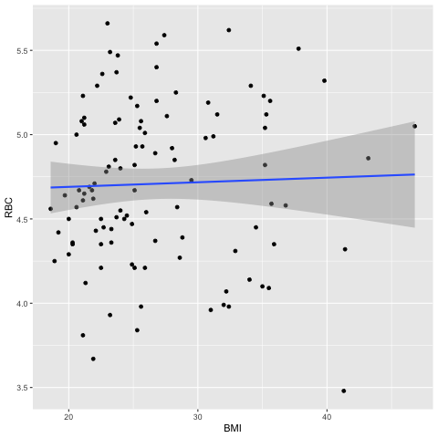
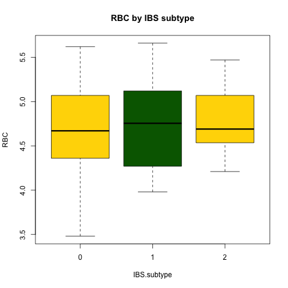
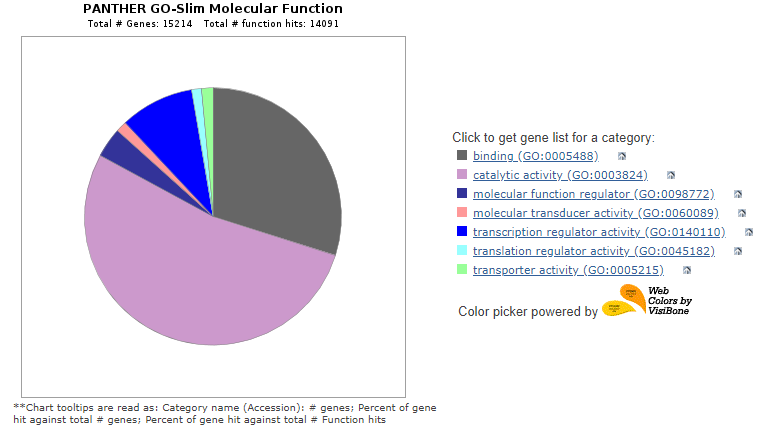

# <p align="center"> *AnalyzeRBC* </p>

# <p align="center"> *Phyo Oo* </p>


### Single regressions, and scatterplots for clinical bloodwork and gene expression data.

[AnalyzeBloodwork.R](https://github.com/phyooo29/AnalyzeRBC/blob/master/data/AnalyzeBloodwork.R) will allow you to load a comma-delimited .csv with various datapoints, perform single and multiple regressions of Body Mass Index (BMI) vs. variables from the Complete Blood Count with Differential (CBC-D) results, and produce 2-D and 3-D scatterplots for the results. 


## Introduction
### Red Blood Cell (RBC) :

Red blood cell is also known as red cell, red blood corpuscles, haematids, erythroid cells or erythrocytes. Red Blood Cells are the most common type of blood cell and the vertevrate's principle means of delivering oxygen (O2) to the body tissues - via blood flow through the circulatory system.The primary function of red blood cells is to transport oxygen to body cells and deliver carbon dioxide to the lungs. A red blood cell has what is known as a biconcave shape.

Wikipedia, Red Blood Cell, https://en.wikipedia.org/wiki/Red_blood_cell

Regina bailey ( July 28, 2019 ) Red Blood Cells (Erythrocytes) : Structure Function, and Related Disorders 
https://www.thoughtco.com/red-blood-cells-373487


Data (RobinsonEtAl_Sup1.csv) was downloaded from: 
Robinson, JM. et al. 2019. Complete blood count with differential: An effective diagnostic for IBS subtype in the context of BMI? BioRxiv. doi: https://doi.org/10.1101/608208.

### Single Regression Test, BMI vs. Bloodwork parameter
```
>RBC.regression <- lm(BMI ~ RBC, data = IBS1)
summary(RBC.regression)
```

### Results of single regression, RBC scatterplot
>ggplot(IBS1, aes(x = BMI, y = RBC)) +
  geom_point() +    
  geom_smooth(method = lm) 

>png("fig_output/RBC_scatterplot.png")
>RBC_scatterplot <- ggplot(IBS1, aes(x = BMI, y = RBC)) +
  geom_point() +    
  geom_smooth(method = lm) 

>print(RBC_scatterplot)

>Call:
lm(formula = BMI ~ RBC, data = IBS1)

>Coefficients:
(Intercept)    RBC  
     21.869        2.458


## Assign "HIGH", "NORMAL", or "LOW" based on clinical range to the RBC_result parameter

```
IBS1$RBC_result[IBS1$RBC > 6.1] <- "HIGH"

IBS1$RBC_result[IBS1$RBC <= 6.1 & IBS1$RBC >= 4.6] <- "NORMAL"

IBS1$RBC_result[IBS1$RBC < 4.6] <- "LOW"
```


### Results of single regression, BMI x Bloodwork parameter
## Box plots
## https://www.statmethods.net/graphs/boxplot.html
>ggplot(IBS1, aes(x=BMI, y=RBC)) +
geom_boxplot(alpha=0.3) +
  theme(legend.position="none")

>boxplot(RBC ~ IBS.subtype, data = IBS1, main="RBC by IBS subtype",
        col=(c("gold" , "darkgreen")), 
        xlab = "IBS.subtype", ylab = "RBC"
        
      
)
>png("fig_output/RBC_boxplot.png")
>RBC_boxplot <- boxplot(RBC ~ IBS.subtype, data = IBS1, main="RBC by IBS subtype",
                       col=(c("gold" , "darkgreen")),
                       xlab = "IBS.subtype", ylab = "RBC"
)
>print(RBC_boxplot)
dev.off()




______________________________________________________________________________________
______________________________________________________________________________________


# <p align="center"> *BTEC395 PROJECT* </p>
## <p align="center"> *Volcano Plot* </p> 

## Read in the table of fold changes
```
FCdata <- read.csv("../data/FC.csv", row.names = 1, header = TRUE)
```

## Read in the table of expression data
```
IBS <- read.csv("../data/GXdata.csv", header = TRUE)
```

## Access only the columns with RNA Expression (subsetting)
```
names(IBS)[28:277]
```

## Make a list of anova(lm()) results for RBC
```
storage <- list()

for(i in names(IBS)[28:277]){
  storage[[i]]  <- anova(lm(get(i) ~ RBCcount, IBS))
}
```
## Extract RBC p-values into a new list
```
pVals <- list()

for(i in names(storage)){
  pVals[[i]] <- -(log10(storage[[i]]$'Pr(>F)'))
}
```
## Convert the pValues list into a data frame. 
```
DFpvalues <- data.frame(matrix(unlist(pVals), nrow=length(pVals), byrow=T))
```
## Combine the results dataframes and write column labels: RBCcount 
```
VolcanoPlotData <- cbind(FCdata, DFpvalues)
names(VolcanoPlotData)[1] <- paste("log2(SlopeDiff)")
names(VolcanoPlotData)[2] <- paste("-log10(Pval)")
```
## Add a column to evaluate significance
```
VolcanoPlotData$Sig <- ifelse(VolcanoPlotData$`-log10(Pval)` > 1.3, "Sig", "Insig");
```
## Install necessary packages
```
install.packages("ggplot2")
library(ggplot2)
# library(ggrepel)
```
##  Output the result of RBC volcano plot into Fig_Output folderppp
```
png("../fig_output/RBCcountplot.png")
RBCplot <- ggplot(VolcanoPlotData, aes(x = `log2(SlopeDiff)`, y = `-log10(Pval)`, label=rownames(VolcanoPlotData), color=Sig)) +
  geom_point(aes(color = Sig)) +
  scale_color_manual(values = c("grey", "red")) +
  theme_bw(base_size = 12) + theme(legend.position = "bottom") +
  geom_text(aes(x = `log2(SlopeDiff)`,y = `-log10(Pval)`, fontface = 1, size=3,  label=row.names(VolcanoPlotData)))


print(RBCplot + ggtitle("Gene Expression vs. RBC Level"))
dev.off()
```
### <p align="center"> Volcano Plot </p>

<p align="center">
  
</p>

### Significant Genes for RBC

|***GENE***|***Complete name***|
|:--:|:-------|
|**BCL2**|B-cell lymphoma 2|
|**CD1B**|CD1b Molecule|
|**CD6**|CD6 Molecule|
|**CD62L**|cell adhesion molecule found on leukocytes and the preimplantation embryo, L-selectin|
|**CR2**|complement C3d receptor 2|
|**Etv3**|ETS variant transcription factor 3|
|**Fkbp5**|FKBP prolyl isomerase 5|
|**GNLY**|granulysin|
|**GUSB**|glucuronidase beta|
|**HPSE**|heparanase|
|**IL1R2**|interleukin 1 receptor type 2|
|**Il1rn**|interleukin 1 receptor antagonist|
|**KIR3DL1**|killer cell immunoglobulin like receptor, three Ig domains and long cytoplasmic tail 1|
|**KlF4**|Kruppel like factor 4|
|**lAIR2**|leukocyte associated immunoglobulin like receptor 2|
|**NCR1**|natural cytotoxicity triggering receptor 1|
|**NMUR1**|neuromedin U receptor 1|
|**PDCD1**|programmed cell death 1|
|**PMCH**|pro-melanin concentrating hormone|
|**POLR2A**|POLR2A RNA polymerase II subunit A |
|**TAS1R3**|taste 1 receptor member 3|
|**Tnfsf4**|TNF superfamily member 4|
|**USP9Y**|ubiquitin specific peptidase 9 Y-linked|

### Panther Analysis Result



##
