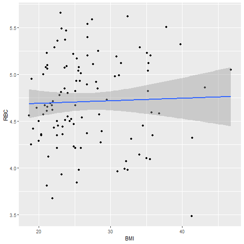

## AnalyzeRBC

### Single regressions, and scatterplots for clinical bloodwork and gene expression data.
([AnalyzeRBC.R](../master/AnalyzeRBC.R)) will allow you to load a comma-delimited .csv with various datapoints, perform single and multiple regressions of Body Mass Index (BMI) vs. variables from the Complete Blood Count with Differential (CBC-D) results, and produce 2-D and 3-D scatterplots for the results. 

Data (RobinsonEtAl_Sup1.csv) was downloaded from: 

Robinson, JM. et al. 2019. Complete blood count with differential: An effective diagnostic for IBS subtype in the context of BMI? BioRxiv. doi: https://doi.org/10.1101/608208.

### Single Regression Test, BMI vs. Bloodwork parameter
RBC.regression <- lm(BMI ~ RBC, data = IBS1)
summary(RBC.regression)

### Results of single regression, RBC scatterplot
>ggplot(IBS1, aes(x = BMI, y = RBC)) +
  geom_point() +    
  geom_smooth(method = lm) 

>png("fig_output/RBC_scatterplot.png")
>RBC_scatterplot <- ggplot(IBS1, aes(x = BMI, y = RBC)) +
  geom_point() +    
  geom_smooth(method = lm) 

>print(RBC_scatterplot)

>Call:
lm(formula = BMI ~ RBC, data = IBS1)

>Coefficients:
(Intercept)    RBC  
     21.869        2.458

## Assign "HIGH", "NORMAL", or "LOW" based on clinical range to the RBC_result parameter

IBS1$RBC_result[IBS1$RBC > 6.1] <- "HIGH"

IBS1$RBC_result[IBS1$RBC <= 6.1 & IBS1$RBC >= 4.6] <- "NORMAL"

IBS1$RBC_result[IBS1$RBC < 4.6] <- "LOW"

### Results of single regression, BMI x Bloodwork parameter
## Box plots
## https://www.statmethods.net/graphs/boxplot.html

>ggplot(IBS1, aes(x=BMI, y=RBC)) +
geom_boxplot(alpha=0.3) +
  theme(legend.position="none")

>boxplot(RBC ~ IBS.subtype, data = IBS1, main="RBC by IBS subtype",
        col=(c("gold" , "darkgreen")), 
        xlab = "IBS.subtype", ylab = "RBC"
        
      
)
>png("fig_output/RBC_boxplot.png")
>RBC_boxplot <- boxplot(RBC ~ IBS.subtype, data = IBS1, main="RBC by IBS subtype",
                       col=(c("gold" , "darkgreen")),
                       xlab = "IBS.subtype", ylab = "RBC"
)
>print(RBC_boxplot)
dev.off()

